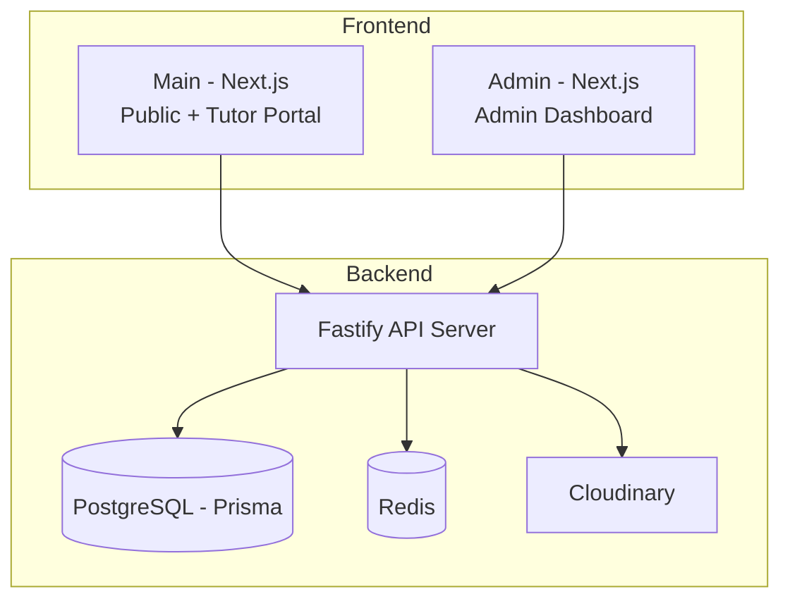
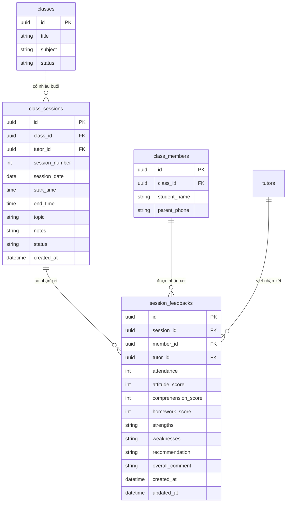

# 📝 Phân Tích & Đề Xuất: Chức Năng Nhận Xét Học Sinh Theo Buổi Học

> **Đồ án**: Song Nguyen EDU — Hệ thống quản lý gia sư  
> **Ngày phân tích**: 2026-05-19  
> **Phạm vi**: ERD, Backend API, Frontend Tutor Portal

---

## 1. Tổng Quan Hệ Thống Hiện Tại

### Kiến trúc đồ án



### ERD hiện tại (các bảng liên quan)

| Bảng | Mô tả |
|------|--------|
| `tutors` | Thông tin gia sư (id, email, fullName, status...) |
| `classes` | Lớp học (title, subject, grade, district, feePerHour, schedule, status) |
| `class_assignments` | Phân công gia sư vào lớp (classId ↔ tutorId, 1-1) |
| `class_members` | Thành viên/học sinh trong lớp (studentName, parentName, parentPhone...) |
| `payments` | Thanh toán (tutorId, classId, amount, status) |

### Cấu trúc Frontend Tutor hiện tại

```
tai-khoan-gia-su/
├── page.tsx              → Dashboard gia sư
├── danh-sach-lop/        → Duyệt lớp mở
├── lop-cua-toi/          → Lớp đã ứng tuyển
├── chi-tiet-lop/[id]/    → Chi tiết lớp
└── ho-so/                → Hồ sơ cá nhân
```

### Backend API hiện có cho Tutor

| Method | Path | Mô tả |
|--------|------|--------|
| GET | `/tutor/profile` | Xem hồ sơ |
| PATCH | `/tutor/profile` | Cập nhật hồ sơ |
| GET | `/tutor/classes` | Lớp đang mở |
| POST | `/tutor/classes/:classId/apply` | Ứng tuyển lớp |
| DELETE | `/tutor/classes/:classId/apply` | Huỷ ứng tuyển |
| GET | `/tutor/applications` | Lớp đã ứng tuyển |
| POST | `/tutor/payments` | Nộp bill |
| GET | `/tutor/payments` | Lịch sử thanh toán |

> [!IMPORTANT]
> **Hiện tại hệ thống KHÔNG CÓ** khái niệm "buổi học" (session/lesson). Lớp học (`classes`) chỉ lưu thông tin tĩnh, không theo dõi từng buổi. Đây là gap lớn nhất cần giải quyết.

---

## 2. Phân Tích Yêu Cầu Chức Năng

### Chức năng cốt lõi
- Gia sư **nhận xét từng học sinh** sau **mỗi buổi dạy**
- Admin/trung tâm có thể **xem báo cáo tiến độ** học tập của học viên
- Phụ huynh có thể được thông báo kết quả

### Các entity cần bổ sung



---

## 3. Đề Xuất ERD Bổ Sung

### 3.1 Bảng `class_sessions` — Quản lý buổi học

```prisma
model ClassSession {
  id            String   @id @default(uuid())
  classId       String   @map("class_id")
  tutorId       String   @map("tutor_id")
  sessionNumber Int      @map("session_number")   // Buổi thứ mấy
  sessionDate   DateTime @map("session_date")      // Ngày dạy
  startTime     String?  @map("start_time")        // "14:00"
  endTime       String?  @map("end_time")          // "16:00"
  topic         String?                            // Chủ đề buổi học
  notes         String?                            // Ghi chú chung của gia sư
  status        SessionStatus @default(SCHEDULED)  // SCHEDULED | COMPLETED | CANCELLED

  createdAt     DateTime @default(now()) @map("created_at")
  updatedAt     DateTime @updatedAt @map("updated_at")

  class         Class    @relation(fields: [classId], references: [id], onDelete: Cascade)
  tutor         Tutor    @relation(fields: [tutorId], references: [id])
  feedbacks     SessionFeedback[]

  @@unique([classId, sessionNumber])
  @@index([classId, sessionDate])
  @@index([tutorId, sessionDate])
  @@map("class_sessions")
}
```

### 3.2 Bảng `session_feedbacks` — Nhận xét học sinh

```prisma
model SessionFeedback {
  id                  String   @id @default(uuid())
  sessionId           String   @map("session_id")
  memberId            String   @map("member_id")
  tutorId             String   @map("tutor_id")

  // Điểm danh
  attendance          AttendanceStatus @default(PRESENT) // PRESENT | ABSENT | LATE | EXCUSED

  // Đánh giá theo thang điểm 1-5
  attitudeScore       Int?     @map("attitude_score")        // Thái độ học tập
  comprehensionScore  Int?     @map("comprehension_score")   // Mức độ tiếp thu
  homeworkScore       Int?     @map("homework_score")        // Bài tập về nhà

  // Nhận xét chi tiết
  strengths           String?                                 // Điểm mạnh
  weaknesses          String?                                 // Điểm cần cải thiện
  recommendation      String?                                 // Khuyến nghị
  overallComment      String?  @map("overall_comment")       // Nhận xét tổng

  createdAt           DateTime @default(now()) @map("created_at")
  updatedAt           DateTime @updatedAt @map("updated_at")

  session             ClassSession @relation(fields: [sessionId], references: [id], onDelete: Cascade)
  member              ClassMember  @relation(fields: [memberId], references: [id], onDelete: Cascade)
  tutor               Tutor        @relation(fields: [tutorId], references: [id])

  @@unique([sessionId, memberId])  // Mỗi học sinh chỉ có 1 nhận xét per buổi
  @@index([sessionId])
  @@index([memberId])
  @@index([tutorId, createdAt(sort: Desc)])
  @@map("session_feedbacks")
}
```

### 3.3 Enums mới

```prisma
enum SessionStatus {
  SCHEDULED   // Đã lên lịch
  COMPLETED   // Đã hoàn thành
  CANCELLED   // Đã huỷ
}

enum AttendanceStatus {
  PRESENT     // Có mặt
  ABSENT      // Vắng mặt
  LATE        // Đến muộn
  EXCUSED     // Có phép
}
```

### 3.4 Cập nhật relations cho các bảng hiện có

```prisma
// Thêm vào model Class
model Class {
  // ... existing fields ...
  sessions    ClassSession[]
}

// Thêm vào model Tutor
model Tutor {
  // ... existing fields ...
  sessions    ClassSession[]
  feedbacks   SessionFeedback[]
}

// Thêm vào model ClassMember
model ClassMember {
  // ... existing fields ...
  feedbacks   SessionFeedback[]
}
```

---

## 4. Đề Xuất API Endpoints

### 4.1 Tutor Endpoints (viết nhận xét)

| Method | Path | Mô tả |
|--------|------|--------|
| **GET** | `/tutor/classes/:classId/sessions` | Danh sách buổi học của lớp |
| **POST** | `/tutor/classes/:classId/sessions` | Tạo buổi học mới |
| **GET** | `/tutor/sessions/:sessionId` | Chi tiết buổi học |
| **PATCH** | `/tutor/sessions/:sessionId` | Cập nhật thông tin buổi |
| **PATCH** | `/tutor/sessions/:sessionId/complete` | Đánh dấu hoàn thành buổi |
| **GET** | `/tutor/sessions/:sessionId/feedbacks` | Lấy nhận xét đã viết cho buổi |
| **POST** | `/tutor/sessions/:sessionId/feedbacks` | Gửi nhận xét (batch cho nhiều HS) |
| **PATCH** | `/tutor/feedbacks/:feedbackId` | Sửa nhận xét |
| **GET** | `/tutor/classes/:classId/members/:memberId/progress` | Tiến độ tổng hợp của 1 HS |

### 4.2 Admin Endpoints (xem báo cáo)

| Method | Path | Mô tả |
|--------|------|--------|
| **GET** | `/admin/classes/:classId/sessions` | Xem tất cả buổi học |
| **GET** | `/admin/sessions/:sessionId/feedbacks` | Xem nhận xét của buổi |
| **GET** | `/admin/classes/:classId/progress` | Báo cáo tiến độ toàn lớp |
| **GET** | `/admin/members/:memberId/report` | Báo cáo tổng hợp 1 HS |

### 4.3 Chi tiết API Contract

#### `POST /tutor/classes/:classId/sessions` — Tạo buổi học

```json
// Request
{
  "sessionDate": "2026-05-20",
  "startTime": "14:00",
  "endTime": "16:00",
  "topic": "Chương 3: Phương trình bậc 2",
  "notes": "Ôn tập kiến thức cơ bản"
}

// Response
{
  "success": true,
  "data": {
    "id": "uuid",
    "sessionNumber": 5,
    "sessionDate": "2026-05-20",
    "topic": "Chương 3: Phương trình bậc 2",
    "status": "SCHEDULED",
    "members": [
      { "id": "member-uuid", "studentName": "Nguyễn Văn A" },
      { "id": "member-uuid", "studentName": "Trần Thị B" }
    ]
  }
}
```

#### `POST /tutor/sessions/:sessionId/feedbacks` — Gửi nhận xét (Batch)

```json
// Request — gửi nhận xét cho nhiều HS cùng lúc
{
  "feedbacks": [
    {
      "memberId": "member-uuid-1",
      "attendance": "PRESENT",
      "attitudeScore": 4,
      "comprehensionScore": 3,
      "homeworkScore": 5,
      "strengths": "Tích cực phát biểu, làm bài tập đầy đủ",
      "weaknesses": "Còn chậm trong phần giải phương trình",
      "recommendation": "Cần luyện thêm dạng bài phương trình tham số",
      "overallComment": "Tiến bộ tốt so với buổi trước"
    },
    {
      "memberId": "member-uuid-2",
      "attendance": "ABSENT",
      "overallComment": "Vắng mặt không phép"
    }
  ]
}

// Response
{
  "success": true,
  "data": {
    "submitted": 2,
    "sessionId": "session-uuid"
  }
}
```

---

## 5. Đề Xuất Thiết Kế Frontend Tutor

### 5.1 Routing cần bổ sung

```
tai-khoan-gia-su/
├── ...existing routes...
├── lop-cua-toi/
│   └── [classId]/
│       ├── page.tsx                → Chi tiết lớp được phân + list buổi học
│       ├── buoi-hoc/
│       │   ├── tao-moi/page.tsx    → Form tạo buổi học
│       │   └── [sessionId]/
│       │       ├── page.tsx        → Chi tiết buổi + list nhận xét
│       │       └── nhan-xet/page.tsx → Form nhận xét học sinh
│       └── hoc-sinh/
│           └── [memberId]/page.tsx → Tiến độ tổng hợp 1 HS
```

### 5.2 Wireframe các màn hình chính

#### Màn A: Danh sách buổi học (của 1 lớp được phân công)

```
┌─────────────────────────────────────────────────────┐
│  ← Quay lại    Lớp Toán 12 - Quận 7                │
│                                                      │
│  ┌─────────────────────────────────────────────┐    │
│  │ 📊 Tổng quan                                │    │
│  │ Tổng buổi: 12   Đã dạy: 8   Sắp tới: 4    │    │
│  └─────────────────────────────────────────────┘    │
│                                                      │
│  [+ Tạo Buổi Học Mới]                              │
│                                                      │
│  ┌─────────────────────────────────────────────┐    │
│  │ Buổi 8 • 18/05/2026                         │    │
│  │ Chương 5: Tích phân                          │    │
│  │ 14:00 - 16:00 │ ✅ Đã hoàn thành            │    │
│  │ [3/3 đã nhận xét]     [Xem nhận xét →]      │    │
│  └─────────────────────────────────────────────┘    │
│                                                      │
│  ┌─────────────────────────────────────────────┐    │
│  │ Buổi 9 • 20/05/2026                         │    │
│  │ Ôn tập giữa kỳ                              │    │
│  │ 14:00 - 16:00 │ 📅 Đã lên lịch             │    │
│  │ [0/3 đã nhận xét]     [Viết nhận xét →]     │    │
│  └─────────────────────────────────────────────┘    │
└─────────────────────────────────────────────────────┘
```

#### Màn B: Form nhận xét học sinh (cho 1 buổi)

```
┌──────────────────────────────────────────────────────┐
│  ← Quay lại    Nhận Xét Buổi 8 • 18/05/2026         │
│                Chương 5: Tích phân                    │
│                                                       │
│  ┌────────────────────────────────────────────────┐  │
│  │ 👤 Nguyễn Văn A  (Lớp 12)                     │  │
│  │                                                 │  │
│  │ Điểm danh:  ○ Có mặt  ○ Vắng  ○ Muộn  ○ Phép │  │
│  │                                                 │  │
│  │ Thái độ:      ★★★★☆  (4/5)                    │  │
│  │ Tiếp thu:     ★★★☆☆  (3/5)                    │  │
│  │ Bài tập:      ★★★★★  (5/5)                    │  │
│  │                                                 │  │
│  │ Điểm mạnh:                                     │  │
│  │ ┌──────────────────────────────────────────┐   │  │
│  │ │ Tích cực phát biểu, làm bài đầy đủ      │   │  │
│  │ └──────────────────────────────────────────┘   │  │
│  │                                                 │  │
│  │ Cần cải thiện:                                  │  │
│  │ ┌──────────────────────────────────────────┐   │  │
│  │ │ Kỹ năng tính toán cần nhanh hơn         │   │  │
│  │ └──────────────────────────────────────────┘   │  │
│  │                                                 │  │
│  │ Nhận xét tổng:                                  │  │
│  │ ┌──────────────────────────────────────────┐   │  │
│  │ │ Tiến bộ tốt, cần luyện thêm dạng bài... │   │  │
│  │ └──────────────────────────────────────────┘   │  │
│  └────────────────────────────────────────────────┘  │
│                                                       │
│  ┌────────────────────────────────────────────────┐  │
│  │ 👤 Trần Thị B  (Lớp 12)                       │  │
│  │ ... (tương tự)                                  │  │
│  └────────────────────────────────────────────────┘  │
│                                                       │
│              [💾 Lưu Nhận Xét]                       │
└──────────────────────────────────────────────────────┘
```

#### Màn C: Tiến độ tổng hợp 1 Học Sinh

```
┌──────────────────────────────────────────────────────┐
│  ← Quay lại    Tiến Độ Học Tập                       │
│                                                       │
│  ┌────────────────────────────────────────────────┐  │
│  │ 👤 Nguyễn Văn A                                │  │
│  │ Lớp 12 • Phụ huynh: Nguyễn Văn B (0901...)    │  │
│  └────────────────────────────────────────────────┘  │
│                                                       │
│  ┌─ Thống Kê Tổng Quan ────────────────────────┐    │
│  │ Tổng buổi: 8  │ Có mặt: 7  │ Vắng: 1      │    │
│  │ TB Thái độ: 4.2 │ TB Tiếp thu: 3.5          │    │
│  └──────────────────────────────────────────────┘    │
│                                                       │
│  ┌─ Biểu Đồ Tiến Bộ ──────────────────────────┐    │
│  │  5 ┤          ●    ●                         │    │
│  │  4 ┤   ●  ●      ●   ●  ●                   │    │
│  │  3 ┤●                        ← Thái độ      │    │
│  │  2 ┤                         ← Tiếp thu     │    │
│  │  1 ┤                         ← Bài tập      │    │
│  │    └─B1─B2─B3─B4─B5─B6─B7─B8──              │    │
│  └──────────────────────────────────────────────┘    │
│                                                       │
│  ┌─ Lịch Sử Nhận Xét ─────────────────────────┐    │
│  │ Buổi 8 • 18/05 │ ★4 ★3 ★5 │ "Tiến bộ..." │    │
│  │ Buổi 7 • 15/05 │ ★4 ★4 ★4 │ "Ổn định..." │    │
│  │ Buổi 6 • 12/05 │ ★3 ★3 ★3 │ "Cần cố..."  │    │
│  │ ...                                          │    │
│  └──────────────────────────────────────────────┘    │
└──────────────────────────────────────────────────────┘
```

---

## 6. Business Logic Cần Implement

### Flow J — Gia sư tạo buổi học & nhận xét

```
Pre-check: TUTOR + APPROVED + classAssignment tồn tại cho tutorId & classId

Steps:
1. Gia sư vào lớp được phân: GET /tutor/classes/:classId/sessions
2. Tạo buổi học: POST /tutor/classes/:classId/sessions
   - Auto-generate sessionNumber (max + 1)
   - Validate: classId assigned to this tutor
   - Status = SCHEDULED
3. Sau buổi dạy, viết nhận xét:
   POST /tutor/sessions/:sessionId/feedbacks
   - Batch submission cho tất cả class_members
   - Validate: session belongs to tutor
   - Validate: score range 1-5
4. Đánh dấu hoàn thành:
   PATCH /tutor/sessions/:sessionId/complete
   - Update status = COMPLETED

Kết quả: SessionStatus = COMPLETED + feedbacks saved
```

### Current API Implementation (Phase 2)

Base prefix: `/api/v1`

**Tutor endpoints (implemented)**

- `GET /tutor/classes/:classId/sessions`
  - Yêu cầu class đã được phân cho tutor.
  - Trả về danh sách buổi + số feedback đã nộp.
- `POST /tutor/classes/:classId/sessions`
  - Tự tăng `sessionNumber` theo class.
  - Chỉ tutor của lớp được tạo.
- `GET /tutor/sessions/:sessionId`
  - Tutor chỉ xem buổi của chính mình.
- `PATCH /tutor/sessions/:sessionId`
  - Cập nhật thông tin buổi (date/time/topic/notes).
- `PATCH /tutor/sessions/:sessionId/complete`
  - Chỉ cho complete khi đã có feedback đủ cho toàn bộ học sinh.
- `GET /tutor/sessions/:sessionId/feedbacks`
  - Lấy feedback đã nhập cho buổi.
- `POST /tutor/sessions/:sessionId/feedbacks`
  - Batch bắt buộc đủ toàn bộ học sinh trong lớp.
  - Validate `attendance` theo enum (PRESENT/ABSENT/LATE/EXCUSED).
- `PATCH /tutor/feedbacks/:feedbackId`
  - Tutor chỉ sửa feedback của mình.
- `GET /tutor/classes/:classId/members/:memberId/progress`
  - Tổng hợp tiến độ của 1 học sinh trong lớp.

**Admin endpoints (implemented)**

- `GET /admin/classes/:classId/sessions`
  - Xem danh sách buổi học của lớp.
- `POST /admin/classes/:classId/sessions`
  - Admin tạo buổi học.
  - Nếu lớp đã phân, `tutorId` phải khớp gia sư được phân.
- `GET /admin/sessions/:sessionId/feedbacks`
  - Xem nhận xét của buổi.
- `GET /admin/classes/:classId/progress`
  - Báo cáo tiến độ tổng hợp toàn lớp.
- `GET /admin/members/:memberId/report`
  - Báo cáo tổng hợp 1 học sinh.

**Notes**

- Hiện chưa kiểm tra range điểm 1-5 ở backend.
- Chưa chặn nhận xét cho buổi `CANCELLED`.

### Validation Rules

| Rule | Mô tả |
|------|--------|
| Gia sư chỉ tạo buổi học cho lớp **đã được phân công** | Check `class_assignments` |
| Gia sư chỉ nhận xét cho buổi của **chính mình** | Check `session.tutorId === request.user.sub` |
| Score phải nằm trong khoảng **1-5** | Zod validation |
| Mỗi HS chỉ có **1 nhận xét/buổi** | `@@unique([sessionId, memberId])` |
| Không thể nhận xét buổi đã **CANCELLED** | Check session.status |
| Chỉ PATCH feedback trong **7 ngày** sau tạo | Business rule ở service |

---

## 7. Các Hướng Triển Khai (3 Options)

### Option A: MVP — Nhận xét đơn giản (1-2 ngày)

> [!TIP]
> Phù hợp nếu cần ship nhanh, ít thay đổi ERD

- **Chỉ thêm 1 bảng** `session_feedbacks` (không cần `class_sessions`)
- Gia sư viết nhận xét trực tiếp cho `class_member`, gắn ngày + thông tin buổi trong chính feedback
- Không có concept "buổi học" tách biệt
- Frontend: 1 form nhận xét ở trang chi tiết lớp

**Pros**: Nhanh, ít migration  
**Cons**: Không quản lý được buổi học, khó mở rộng

---

### Option B: Standard — Buổi học + Nhận xét (3-5 ngày) ⭐ KHUYẾN NGHỊ

> [!IMPORTANT]
> Đây là option cân bằng nhất giữa tính năng và effort

- **Thêm 2 bảng**: `class_sessions` + `session_feedbacks`
- Gia sư tạo buổi → viết nhận xét theo buổi → xem tiến độ
- Admin xem báo cáo tổng hợp
- Frontend: 3 màn hình (list buổi, form nhận xét, tiến độ HS)

**Pros**: Đầy đủ tính năng, dễ mở rộng  
**Cons**: Cần 2 migration, ~5 endpoints mới

---

### Option C: Full — Báo cáo toàn diện (7-10 ngày)

- Tất cả của Option B + thêm:
  - **Notification system**: gửi nhận xét qua email/SMS cho phụ huynh
  - **PDF Report**: export báo cáo tiến độ dạng PDF
  - **Dashboard charts**: biểu đồ tiến bộ theo thời gian (Chart.js/Recharts)
  - **Template nhận xét**: mẫu nhận xét gợi ý cho gia sư
  - **Parent portal**: phụ huynh xem nhận xét online

**Pros**: Chuyên nghiệp, toàn diện  
**Cons**: Effort lớn, nhiều tính năng phụ

---

## 8. Kế Hoạch Triển Khai (Option B)

### Phase 1: Backend (2 ngày)

| Task | File | Ước tính |
|------|------|----------|
| Thêm enum + 2 model vào schema.prisma | `prisma/schema.prisma` | 30m |
| `prisma migrate dev` | — | 15m |
| Thêm session & feedback routes vào tutor module | `modules/tutor/tutor.route.ts` | 4h |
| Thêm admin report routes | `modules/admin/admin.route.ts` | 2h |
| Viết Zod schemas cho validation | `modules/tutor/tutor.schema.ts` | 1h |

### Phase 2: Frontend Tutor (2-3 ngày)

| Task | File | Ước tính |
|------|------|----------|
| Trang danh sách buổi học | `lop-cua-toi/[classId]/page.tsx` | 3h |
| Form tạo buổi học | `buoi-hoc/tao-moi/page.tsx` | 2h |
| Form nhận xét (batch) | `buoi-hoc/[sessionId]/nhan-xet/page.tsx` | 4h |
| Trang tiến độ học sinh | `hoc-sinh/[memberId]/page.tsx` | 3h |
| CSS styling theo design system | `styles/session.css` | 2h |

### Phase 3: Admin Dashboard (1 ngày)

| Task | File | Ước tính |
|------|------|----------|
| Xem nhận xét trong class detail | `(admin)/classes/[id]/sessions/` | 3h |
| Báo cáo tiến độ HS | `(admin)/classes/[id]/progress/` | 2h |

---

## 9. Checklist Kiểm Thử

- [ ] Gia sư tạo buổi học → sessionNumber tự tăng
- [ ] Gia sư nhận xét batch → lưu cho tất cả HS
- [ ] Score validation 1-5 → reject ngoài range
- [ ] Gia sư A không thể nhận xét lớp của gia sư B
- [ ] Unique constraint: 1 HS chỉ có 1 feedback/buổi
- [ ] Admin xem được tất cả nhận xét
- [ ] API trả progress report đúng (average scores)
- [ ] CANCELLED session không cho nhận xét

---

## 10. Tóm Tắt Quyết Định

| Quyết định | Giá trị |
|------------|---------|
| **Hướng triển khai** | Option B: Standard (2 bảng mới) |
| **Bảng mới** | `class_sessions`, `session_feedbacks` |
| **Enum mới** | `SessionStatus`, `AttendanceStatus` |
| **Endpoints mới (Tutor)** | ~6 endpoints |
| **Endpoints mới (Admin)** | ~4 endpoints |
| **Màn hình FE mới** | ~4 trang |
| **Effort ước tính** | 5-7 ngày |

> [!NOTE]
> Bạn muốn tôi bắt đầu implement theo Option nào? Tôi recommend **Option B** vì cân bằng giữa chức năng và thời gian triển khai. Có thể bắt đầu từ backend (migration + API) hoặc frontend (UI) trước tuỳ bạn chọn.
